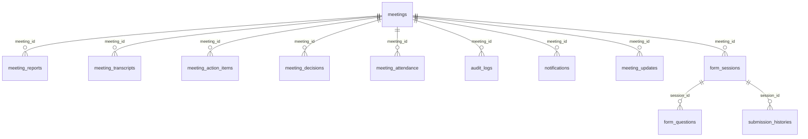

# AgentOS — Unified PostgreSQL Database Schema

> **Connection:** Use the `DATABASE_URL` from the shared Render PostgreSQL instance.
> **Note:** All primary keys are `UUID`. All timestamps are UTC.

---

## Table Relationship Overview



---

## 🔑 Core Table: [meetings](file:///d:/Downloads/meeting-agent/email-agent/app/main.py#35-38)

> This is the **primary table** your friend's agent should query. It stores every meeting AND form link detected from email.

| Column | Type | Nullable | Description |
|---|---|---|---|
| `id` | `UUID` | PK | Unique meeting/form identifier |
| `title` | `VARCHAR(255)` | No | Meeting or form title |
| `meeting_url` | `TEXT` | Yes | **The link to the Google Meet, Zoom, Teams, Google Form, etc.** |
| `meeting_date` | `DATE` | Yes | Scheduled date |
| `start_time` | `TIME` | Yes | Scheduled start time |
| `end_time` | `TIME` | Yes | Scheduled end time |
| `platform` | `VARCHAR(50)` | Yes | e.g. `Google Meet`, `Zoom`, `Google Forms`, `Typeform` |
| `meeting_id` | `VARCHAR(255)` | Yes | Platform-specific meeting code |
| `passcode` | `VARCHAR(255)` | Yes | Meeting passcode if present |
| [status](file:///d:/Downloads/meeting-agent/meeting-agent/app/db/crud.py#74-83) | `VARCHAR(50)` | Yes | `scheduled` \| `joining` \| `in_progress` \| `completed` \| `failed` |
| `email_id` | `VARCHAR(255)` | Yes | Source email ID (unique, indexed) |
| `organizer` | `VARCHAR(255)` | Yes | Sender/organizer email address |
| `description` | `TEXT` | Yes | Full email body / event description |
| `time_zone` | `VARCHAR(50)` | Yes | Detected timezone string |
| `created_at` | `TIMESTAMP` | Yes | Row creation time (UTC) |
| `updated_at` | `TIMESTAMP` | Yes | Last status update time (UTC) |

### Query example for your friend's agent:
```sql
-- Get all Form links detected (Google Forms, Typeform, etc.)
SELECT id, title, meeting_url, platform, organizer, created_at
FROM meetings
WHERE platform ILIKE '%form%' OR platform ILIKE '%typeform%' OR platform ILIKE '%survey%'
ORDER BY created_at DESC;

-- Get all unprocessed forms (still scheduled)
SELECT id, title, meeting_url, platform
FROM meetings
WHERE status = 'scheduled'
  AND (platform ILIKE '%form%' OR meeting_url ILIKE '%forms.gle%' OR meeting_url ILIKE '%typeform%');
```

---

## 📄 `meeting_transcripts`

Stores the Whisper-generated speech-to-text transcript after the bot leaves the meeting.

| Column | Type | Nullable | Description |
|---|---|---|---|
| `id` | `UUID` | PK | |
| `meeting_id` | `UUID` | FK → `meetings.id` | |
| [transcript](file:///d:/Downloads/meeting-agent/meeting-agent/app/api/routes.py#44-50) | `TEXT` | No | Full spoken transcript |
| `language` | `VARCHAR(20)` | Yes | Detected language code (e.g. [en](file:///D:/Downloads/meeting-agent/email-agent/app/templates/dashboard.html#647-672)) |
| `created_at` | `TIMESTAMP` | Yes | |

---

## 📊 `meeting_reports`

Stores the Gemini/Groq-generated AI summary after transcription.

| Column | Type | Nullable | Description |
|---|---|---|---|
| `id` | `UUID` | PK | |
| `meeting_id` | `UUID` | FK → `meetings.id` | |
| [summary](file:///d:/Downloads/meeting-agent/email-agent/app/main.py#113-120) | `TEXT` | Yes | Full AI-generated summary text |
| `key_points` | `TEXT` | Yes | JSON array of key bullet points `["point1", "point2"]` |
| `follow_up` | `TEXT` | Yes | JSON array of follow-up actions `["action1"]` |
| `sentiment` | `VARCHAR(50)` | Yes | e.g. `positive`, `neutral`, `negative` |
| `created_at` | `TIMESTAMP` | Yes | |

---

## ✅ `meeting_action_items`

Structured action items extracted from the transcript.

| Column | Type | Nullable | Description |
|---|---|---|---|
| `id` | `UUID` | PK | |
| `meeting_id` | `UUID` | FK → `meetings.id` | |
| `assigned_to` | `VARCHAR(255)` | Yes | Person responsible |
| `task` | `TEXT` | No | Task description |
| `deadline` | `VARCHAR(100)` | Yes | Free-text deadline |
| [status](file:///d:/Downloads/meeting-agent/meeting-agent/app/db/crud.py#74-83) | `VARCHAR(50)` | Yes | [open](file:///D:/Downloads/meeting-agent/email-agent/app/templates/dashboard.html#647-672) \| `done` |
| `created_at` | `TIMESTAMP` | Yes | |

---

## 🧠 `meeting_decisions`

Key decisions extracted from the transcript.

| Column | Type | Nullable | Description |
|---|---|---|---|
| `id` | `UUID` | PK | |
| `meeting_id` | `UUID` | FK → `meetings.id` | |
| [decision](file:///d:/Downloads/meeting-agent/meeting-agent/app/db/crud.py#197-200) | `TEXT` | No | Decision text |
| `created_at` | `TIMESTAMP` | Yes | |

---

## 👥 `meeting_attendance`

Bot join/leave timing for each processed meeting.

| Column | Type | Nullable | Description |
|---|---|---|---|
| `id` | `UUID` | PK | |
| `meeting_id` | `UUID` | FK → `meetings.id` | |
| `participant` | `VARCHAR(255)` | Yes | Bot display name |
| `join_time` | `TIMESTAMP` | Yes | UTC join time |
| `leave_time` | `TIMESTAMP` | Yes | UTC leave time |
| `duration_seconds` | `INTEGER` | Yes | Total seconds in meeting |
| `bot_joined` | `BOOLEAN` | Yes | Always `true` for bot rows |
| `created_at` | `TIMESTAMP` | Yes | |

---

## 🔔 [notifications](file:///D:/Downloads/meeting-agent/email-agent/app/main.py#52-55)

Ephemeral alerts displayed in the dashboard.

| Column | Type | Nullable | Description |
|---|---|---|---|
| `id` | `UUID` | PK | |
| `meeting_id` | `UUID` | Yes | |
| `message` | `TEXT` | Yes | Notification text |
| `type` | `VARCHAR(50)` | Yes | `info` \| `success` \| `error` |
| `created_at` | `TIMESTAMP` | Yes | |

---

## 📋 `audit_logs`

Internal system event log for all bot actions.

| Column | Type | Nullable | Description |
|---|---|---|---|
| `id` | `UUID` | PK | |
| `meeting_id` | `UUID` | Yes | |
| [action](file:///d:/Downloads/meeting-agent/meeting-agent/app/api/routes.py#66-73) | `VARCHAR(255)` | Yes | e.g. `join_attempt`, `joined`, `completed` |
| `details` | `TEXT` | Yes | Extra context |
| `created_at` | `TIMESTAMP` | Yes | |

---

## 🔄 `meeting_updates`

Append-only log of every status change on a meeting.

| Column | Type | Nullable | Description |
|---|---|---|---|
| `id` | `UUID` | PK | |
| `meeting_id` | `UUID` | Yes | |
| `old_status` | `VARCHAR(50)` | Yes | Previous status |
| `new_status` | `VARCHAR(50)` | Yes | New status |
| `created_at` | `TIMESTAMP` | Yes | |

---

## 🤖 Form Filler Agent Integration Tables

These tables support the Form Filler Agent which automatically or manually fills Google Forms detected from incoming emails.

### 📋 `form_sessions`

Stores active automation sessions initiated from a form link (e.g., from the `meetings` table).

| Column | Type | Nullable | Description |
|---|---|---|---|
| `id` | `VARCHAR(64)` | PK | Session ID (UUID string) |
| `meeting_id` | `UUID` | FK → `meetings.id` | The source email/form link from the meetings table |
| `form_url` | `TEXT` | No | Target Google Form URL |
| `title` | `VARCHAR(550)` | Yes | Extracted form title |
| `description` | `TEXT` | Yes | Extracted form description |
| `status` | `VARCHAR(50)` | No | `analyzing` \| `missing_info` \| `review` \| `executing` \| `completed` \| `failed` |
| `fill_mode` | `VARCHAR(20)` | No | `auto` \| `manual` |
| `created_at` | `TIMESTAMP` | Yes | |
| `updated_at` | `TIMESTAMP` | Yes | |

---

### ❓ `form_questions`

Stores questions extracted from the Google Form during the analysis phase.

| Column | Type | Nullable | Description |
|---|---|---|---|
| `id` | `INTEGER` | PK | Auto-incrementing identifier |
| `session_id` | `VARCHAR(64)` | FK → `form_sessions.id` | Associated session |
| `field_id` | `VARCHAR(100)` | No | Playwright-scraped form field ID |
| `question_text` | `TEXT` | No | The question text |
| `field_type` | `VARCHAR(50)` | No | e.g., `short_text`, `paragraph`, `radio`, `checkbox`, `dropdown` |
| `is_required` | `BOOLEAN` | No | Flag indicating if field is mandatory |
| `options_json` | `TEXT` | Yes | JSON string array of multiple-choice options |
| `proposed_answer` | `TEXT` | Yes | AI matched answer from User Profile |
| `confidence_score` | `FLOAT` | No | Semantic similarity score |
| `source` | `VARCHAR(50)` | No | Answer source: `AI` \| `Profile` \| `User` \| `Missing` |
| `is_missing` | `BOOLEAN` | No | True if required answer is missing in profile |
| `user_answer` | `TEXT` | Yes | The finalized answer confirmed/provided by the user |

---

### 👤 `user_profiles`

Global dictionary of user details used to fill out the form questions semantically.

| Column | Type | Nullable | Description |
|---|---|---|---|
| `id` | `INTEGER` | PK | Auto-incrementing identifier |
| `field_key` | `VARCHAR(255)` | No | Unique question key name (e.g., `Full Name`, `Email`) |
| `field_value` | `TEXT` | No | The standard answer value |
| `category` | `VARCHAR(100)` | No | Category grouping: e.g., `General`, `Social`, `Documents` |
| `created_at` | `TIMESTAMP` | Yes | |
| `updated_at` | `TIMESTAMP` | Yes | |

---

### 📂 `resume_files`

Binary storage for file attachments (resumes, CVs, cover letters) to be uploaded automatically into form file input fields.

| Column | Type | Nullable | Description |
|---|---|---|---|
| `id` | `INTEGER` | PK | Auto-incrementing identifier |
| `filename` | `VARCHAR(255)` | No | Name of the uploaded file |
| `content_type` | `VARCHAR(100)` | No | MIME type of the file |
| `file_data` | `BYTEA` | No | Binary file data |
| `uploaded_at` | `TIMESTAMP` | Yes | |

---

### 📜 `submission_histories`

Keeps logs and status receipts of all form-filling automation attempts.

| Column | Type | Nullable | Description |
|---|---|---|---|
| `id` | `INTEGER` | PK | Auto-incrementing identifier |
| `session_id` | `VARCHAR(64)` | FK → `form_sessions.id` | Session source |
| `form_url` | `TEXT` | No | Submitted Form URL |
| `title` | `VARCHAR(255)` | No | Title of the Google Form |
| `status` | `VARCHAR(50)` | No | Submission status: `success` \| `failed` |
| `submitted_at` | `TIMESTAMP` | Yes | |
| `summary_json` | `TEXT` | Yes | JSON map of submitted question-answer pairs |
| `log_json` | `TEXT` | Yes | JSON list of execution steps (Playwright execution logs) |
