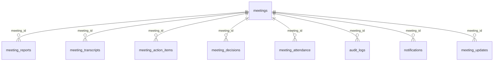
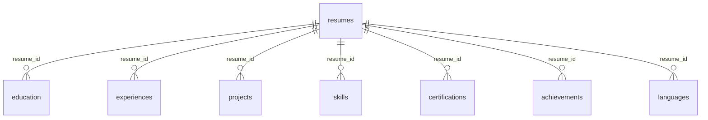

# AgentOS — Unified PostgreSQL Database Schema

> **Connection:** Use the `DATABASE_URL` from the shared Render PostgreSQL instance.
> **Note:** All primary keys are `UUID`. All timestamps are UTC.

---

## Table Relationship Overview



---

## 🔑 Core Table: [meetings](file:///d:/Downloads/meeting-agent/email-agent/app/main.py#35-38)

> This is the **primary table** your friend's agent should query. It stores every meeting AND form link detected from email.

| Column | Type | Nullable | Description |
|---|---|---|---|
| `id` | `UUID` | PK | Unique meeting/form identifier |
| `title` | `VARCHAR(255)` | No | Meeting or form title |
| `meeting_url` | `TEXT` | Yes | **The link to the Google Meet, Zoom, Teams, Google Form, etc.** |
| `meeting_date` | `DATE` | Yes | Scheduled date |
| `start_time` | `TIME` | Yes | Scheduled start time |
| `end_time` | `TIME` | Yes | Scheduled end time |
| `platform` | `VARCHAR(50)` | Yes | e.g. `Google Meet`, `Zoom`, `Google Forms`, `Typeform` |
| `meeting_id` | `VARCHAR(255)` | Yes | Platform-specific meeting code |
| `passcode` | `VARCHAR(255)` | Yes | Meeting passcode if present |
| [status](file:///d:/Downloads/meeting-agent/meeting-agent/app/db/crud.py#74-83) | `VARCHAR(50)` | Yes | `scheduled` \| `joining` \| `in_progress` \| `completed` \| `failed` |
| `email_id` | `VARCHAR(255)` | Yes | Source email ID (unique, indexed) |
| `organizer` | `VARCHAR(255)` | Yes | Sender/organizer email address |
| `description` | `TEXT` | Yes | Full email body / event description |
| `time_zone` | `VARCHAR(50)` | Yes | Detected timezone string |
| `created_at` | `TIMESTAMP` | Yes | Row creation time (UTC) |
| `updated_at` | `TIMESTAMP` | Yes | Last status update time (UTC) |

### Query example for your friend's agent:
```sql
-- Get all Form links detected (Google Forms, Typeform, etc.)
SELECT id, title, meeting_url, platform, organizer, created_at
FROM meetings
WHERE platform ILIKE '%form%' OR platform ILIKE '%typeform%' OR platform ILIKE '%survey%'
ORDER BY created_at DESC;

-- Get all unprocessed forms (still scheduled)
SELECT id, title, meeting_url, platform
FROM meetings
WHERE status = 'scheduled'
  AND (platform ILIKE '%form%' OR meeting_url ILIKE '%forms.gle%' OR meeting_url ILIKE '%typeform%');
```

---

## 📄 `meeting_transcripts`

Stores the Whisper-generated speech-to-text transcript after the bot leaves the meeting.

| Column | Type | Nullable | Description |
|---|---|---|---|
| `id` | `UUID` | PK | |
| `meeting_id` | `UUID` | FK → `meetings.id` | |
| [transcript](file:///d:/Downloads/meeting-agent/meeting-agent/app/api/routes.py#44-50) | `TEXT` | No | Full spoken transcript |
| `language` | `VARCHAR(20)` | Yes | Detected language code (e.g. [en](file:///D:/Downloads/meeting-agent/email-agent/app/templates/dashboard.html#647-672)) |
| `created_at` | `TIMESTAMP` | Yes | |

---

## 📊 `meeting_reports`

Stores the Gemini/Groq-generated AI summary after transcription.

| Column | Type | Nullable | Description |
|---|---|---|---|
| `id` | `UUID` | PK | |
| `meeting_id` | `UUID` | FK → `meetings.id` | |
| [summary](file:///d:/Downloads/meeting-agent/email-agent/app/main.py#113-120) | `TEXT` | Yes | Full AI-generated summary text |
| `key_points` | `TEXT` | Yes | JSON array of key bullet points `["point1", "point2"]` |
| `follow_up` | `TEXT` | Yes | JSON array of follow-up actions `["action1"]` |
| `sentiment` | `VARCHAR(50)` | Yes | e.g. `positive`, `neutral`, `negative` |
| `created_at` | `TIMESTAMP` | Yes | |

---

## ✅ `meeting_action_items`

Structured action items extracted from the transcript.

| Column | Type | Nullable | Description |
|---|---|---|---|
| `id` | `UUID` | PK | |
| `meeting_id` | `UUID` | FK → `meetings.id` | |
| `assigned_to` | `VARCHAR(255)` | Yes | Person responsible |
| `task` | `TEXT` | No | Task description |
| `deadline` | `VARCHAR(100)` | Yes | Free-text deadline |
| [status](file:///d:/Downloads/meeting-agent/meeting-agent/app/db/crud.py#74-83) | `VARCHAR(50)` | Yes | [open](file:///D:/Downloads/meeting-agent/email-agent/app/templates/dashboard.html#647-672) \| `done` |
| `created_at` | `TIMESTAMP` | Yes | |

---

## 🧠 `meeting_decisions`

Key decisions extracted from the transcript.

| Column | Type | Nullable | Description |
|---|---|---|---|
| `id` | `UUID` | PK | |
| `meeting_id` | `UUID` | FK → `meetings.id` | |
| [decision](file:///d:/Downloads/meeting-agent/meeting-agent/app/db/crud.py#197-200) | `TEXT` | No | Decision text |
| `created_at` | `TIMESTAMP` | Yes | |

---

## 👥 `meeting_attendance`

Bot join/leave timing for each processed meeting.

| Column | Type | Nullable | Description |
|---|---|---|---|
| `id` | `UUID` | PK | |
| `meeting_id` | `UUID` | FK → `meetings.id` | |
| `participant` | `VARCHAR(255)` | Yes | Bot display name |
| `join_time` | `TIMESTAMP` | Yes | UTC join time |
| `leave_time` | `TIMESTAMP` | Yes | UTC leave time |
| `duration_seconds` | `INTEGER` | Yes | Total seconds in meeting |
| `bot_joined` | `BOOLEAN` | Yes | Always `true` for bot rows |
| `created_at` | `TIMESTAMP` | Yes | |

---

## 🔔 [notifications](file:///D:/Downloads/meeting-agent/email-agent/app/main.py#52-55)

Ephemeral alerts displayed in the dashboard.

| Column | Type | Nullable | Description |
|---|---|---|---|
| `id` | `UUID` | PK | |
| `meeting_id` | `UUID` | Yes | |
| `message` | `TEXT` | Yes | Notification text |
| `type` | `VARCHAR(50)` | Yes | `info` \| `success` \| `error` |
| `created_at` | `TIMESTAMP` | Yes | |

---

## 📋 `audit_logs`

Internal system event log for all bot actions.

| Column | Type | Nullable | Description |
|---|---|---|---|
| `id` | `UUID` | PK | |
| `meeting_id` | `UUID` | Yes | |
| [action](file:///d:/Downloads/meeting-agent/meeting-agent/app/api/routes.py#66-73) | `VARCHAR(255)` | Yes | e.g. `join_attempt`, `joined`, `completed` |
| `details` | `TEXT` | Yes | Extra context |
| `created_at` | `TIMESTAMP` | Yes | |

---

## 🔄 `meeting_updates`

Append-only log of every status change on a meeting.

| Column | Type | Nullable | Description |
|---|---|---|---|
| `id` | `UUID` | PK | |
| `meeting_id` | `UUID` | Yes | |
| `old_status` | `VARCHAR(50)` | Yes | Previous status |
| `new_status` | `VARCHAR(50)` | Yes | New status |
| `created_at` | `TIMESTAMP` | Yes | |

---

# 📄 Resume Extractor — Candidate Profile Database Schema

The following tables store candidate resume uploads, AI-extracted executive summaries, contact information, and normalized sub-entities (education, experience, projects, skills, certifications, achievements, languages).

### Resume Tables Relationship Overview



---

## 👤 Core Table: `resumes`

> Stores candidate metadata, parsed text, and contact information.

| Column | Type | Nullable | Description |
|---|---|---|---|
| `id` | `INTEGER` / `UUID` | PK | Unique resume record ID |
| `filename` | `VARCHAR(255)` | No | Original uploaded file name |
| `file_path` | `VARCHAR(512)` | No | Physical disk/cloud storage path |
| `file_type` | `VARCHAR(50)` | Yes | File extension or MIME type |
| `raw_text` | `TEXT` | Yes | Plain text extracted from document |
| `summary` | `TEXT` | Yes | AI-generated executive candidate summary |
| `first_name` | `VARCHAR(100)` | Yes | Candidate first name |
| `last_name` | `VARCHAR(100)` | Yes | Candidate last name |
| `email` | `VARCHAR(255)` | Yes | Candidate email (indexed for search) |
| `phone` | `VARCHAR(50)` | Yes | Phone number |
| `location` | `VARCHAR(255)` | Yes | City, State / Country |
| `linkedin_url` | `VARCHAR(512)` | Yes | LinkedIn profile URL |
| `github_url` | `VARCHAR(512)` | Yes | GitHub profile URL |
| `portfolio_url` | `VARCHAR(512)` | Yes | Personal website / portfolio URL |
| `created_at` | `TIMESTAMP` | Yes | Record creation timestamp (UTC) |
| `updated_at` | `TIMESTAMP` | Yes | Record updated timestamp (UTC) |

---

## 🎓 `education`

> Educational degrees and academic background.

| Column | Type | Nullable | Description |
|---|---|---|---|
| `id` | `INTEGER` / `UUID` | PK | Unique education record ID |
| `resume_id` | `FK → resumes.id` | No | Parent candidate resume reference (CASCADE) |
| `institution` | `VARCHAR(255)` | No | College, University, or Institute name |
| `degree` | `VARCHAR(255)` | Yes | Degree name (e.g. B.Tech, B.S., M.S.) |
| `field_of_study` | `VARCHAR(255)` | Yes | Major or specialization |
| `start_date` | `VARCHAR(50)` | Yes | Start date |
| `end_date` | `VARCHAR(50)` | Yes | Graduation or end date |
| `gpa` | `VARCHAR(20)` | Yes | Grade point average |
| `description` | `TEXT` | Yes | Honors, course highlights |

---

## 💼 `experiences`

> Work history, employment roles, and job accomplishments.

| Column | Type | Nullable | Description |
|---|---|---|---|
| `id` | `INTEGER` / `UUID` | PK | Unique experience record ID |
| `resume_id` | `FK → resumes.id` | No | Parent candidate resume reference (CASCADE) |
| `company` | `VARCHAR(255)` | No | Employer / Organization name |
| `job_title` | `VARCHAR(255)` | No | Job position / title |
| `location` | `VARCHAR(255)` | Yes | Job location |
| `start_date` | `VARCHAR(50)` | Yes | Employment start date |
| `end_date` | `VARCHAR(50)` | Yes | Employment end date |
| `is_current` | `BOOLEAN` | No | `true` if currently working here |
| `description` | `TEXT` | Yes | Key responsibilities & accomplishments |
| `technologies` | `TEXT` | Yes | Comma-separated tech stack used |

---

## 🚀 `projects`

> Key portfolio projects and technical implementations.

| Column | Type | Nullable | Description |
|---|---|---|---|
| `id` | `INTEGER` / `UUID` | PK | Unique project record ID |
| `resume_id` | `FK → resumes.id` | No | Parent candidate resume reference (CASCADE) |
| `title` | `VARCHAR(255)` | No | Project name |
| `description` | `TEXT` | Yes | Overview, architecture, achievements |
| `url` | `VARCHAR(512)` | Yes | GitHub repo or live demo link |
| `technologies` | `TEXT` | Yes | Comma-separated tech stack |
| `start_date` | `VARCHAR(50)` | Yes | Start date |
| `end_date` | `VARCHAR(50)` | Yes | Completion date |

---

## 💡 `skills`

> Technical competencies, tools, and soft skills.

| Column | Type | Nullable | Description |
|---|---|---|---|
| `id` | `INTEGER` / `UUID` | PK | Unique skill record ID |
| `resume_id` | `FK → resumes.id` | No | Parent candidate resume reference (CASCADE) |
| `name` | `VARCHAR(100)` | No | Skill name (e.g. Python, Docker, React) |
| `category` | `VARCHAR(100)` | Yes | Skill category (e.g. Languages, Frameworks) |
| `proficiency` | `VARCHAR(50)` | Yes | Proficiency level |

---

## 📜 `certifications`

> Industry certifications and professional credentials.

| Column | Type | Nullable | Description |
|---|---|---|---|
| `id` | `INTEGER` / `UUID` | PK | Unique certification record ID |
| `resume_id` | `FK → resumes.id` | No | Parent candidate resume reference (CASCADE) |
| `name` | `VARCHAR(255)` | No | Certification name |
| `issuing_organization` | `VARCHAR(255)` | Yes | Issuer (e.g. AWS, Coursera, Google) |
| `issue_date` | `VARCHAR(50)` | Yes | Date issued |
| `credential_id` | `VARCHAR(255)` | Yes | License / Credential ID |
| `credential_url` | `VARCHAR(512)` | Yes | Verification link |

---

## 🏆 `achievements`

> Awards, honors, hackathon placements, and distinctions.

| Column | Type | Nullable | Description |
|---|---|---|---|
| `id` | `INTEGER` / `UUID` | PK | Unique achievement record ID |
| `resume_id` | `FK → resumes.id` | No | Parent candidate resume reference (CASCADE) |
| `title` | `VARCHAR(255)` | No | Award or achievement title |
| `description` | `TEXT` | Yes | Details and context |
| `date` | `VARCHAR(50)` | Yes | Date awarded |

---

## 🗣️ `languages`

> Spoken and written languages.

| Column | Type | Nullable | Description |
|---|---|---|---|
| `id` | `INTEGER` / `UUID` | PK | Unique language record ID |
| `resume_id` | `FK → resumes.id` | No | Parent candidate resume reference (CASCADE) |
| `name` | `VARCHAR(100)` | No | Language name (e.g. English, Spanish) |
| `proficiency` | `VARCHAR(50)` | Yes | Fluency level |

---

## 🔍 Application Integration Query Examples

```sql
-- Search candidate profiles matching a skill (e.g., Python)
SELECT r.id, r.first_name, r.last_name, r.email, r.location, r.summary
FROM resumes r
JOIN skills s ON s.resume_id = r.id
WHERE s.name ILIKE '%python%';

-- Get complete candidate record with all work experience
SELECT r.first_name, r.last_name, r.email, e.company, e.job_title, e.start_date, e.end_date, e.technologies
FROM resumes r
LEFT JOIN experiences e ON e.resume_id = r.id
WHERE r.id = 1;
```

